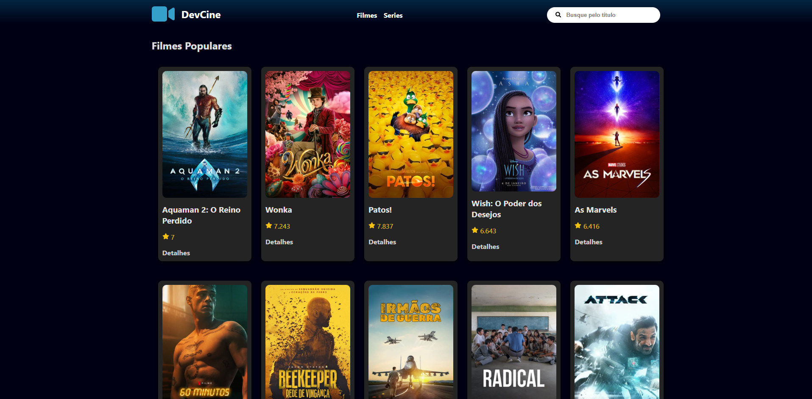
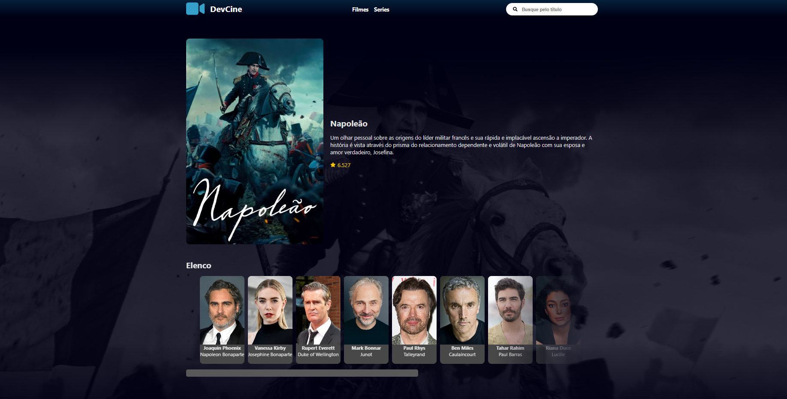
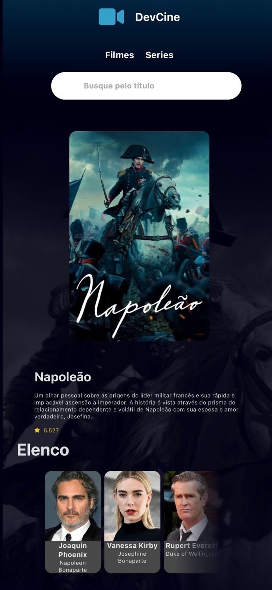

# Movie Library React App

## Descrição do Projeto

Este é um projeto de biblioteca de filmes desenvolvido em React, utilizando a API destacada do The Movies Database. Seu objetivo principal é proporcionar uma experiência de aprendizado e aprimoramento na utilização de APIs.

## Objetivos

1. **Exploração de Filmes:** Permitir aos usuários explorar uma ampla variedade de filmes disponíveis.

2. **Detalhes do Filme:** Utilizar a [API do The Movies Database](https://www.themoviedb.org/documentation/api) para obter informações detalhadas sobre cada filme.

3. **Experiência do Usuário:** Oferecer uma interface amigável e interativa para proporcionar uma experiência envolvente aos usuários.

4. **Aprendizado em React e JavaScript:** Servir como uma oportunidade para aprimorar as habilidades em React e JavaScript, seguindo as melhores práticas de desenvolvimento.

## Funcionalidades

- **Pesquisa:** Capacidade de pesquisar filmes com base em diferentes critérios.
  
- **Detalhes do Filme:** Visualização detalhada de informações sobre cada filme, como elenco, classificação, etc.

- **Exploração:** Navegação fácil e intuitiva para explorar uma ampla variedade de filmes.

## Tecnologias Utilizadas

- React
- [API do The Movies Database](https://www.themoviedb.org/documentation/api)
- JavaScript
- Styled Components (para estilização)

## Demonstração

Acesse o site [aqui](https://movies-react-tmdb.vercel.app/) para visualizar o aplicativo em funcionamento.

### Telas do Aplicativo

#### Tela de PC

#### Tela de Mobile

## Como Executar o Projeto

1. **Clone este repositório.**
2. **Instale as dependências usando o comando:** `npm install`.
3. **Execute o projeto com:** `npm start`.
4. **Acesse [http://localhost:5173](http://localhost:5173) no seu navegador.**
   

## Contribuições

Contribuições são bem-vindas! Sinta-se à vontade para propor melhorias, correções de bugs ou adicionar novos recursos. Por favor, abra uma issue para discutir as mudanças propostas antes de enviar um pull request.

## Autor

Thiago Alves 

📜 Licença

Este projeto está licenciado sob a licença MIT.
